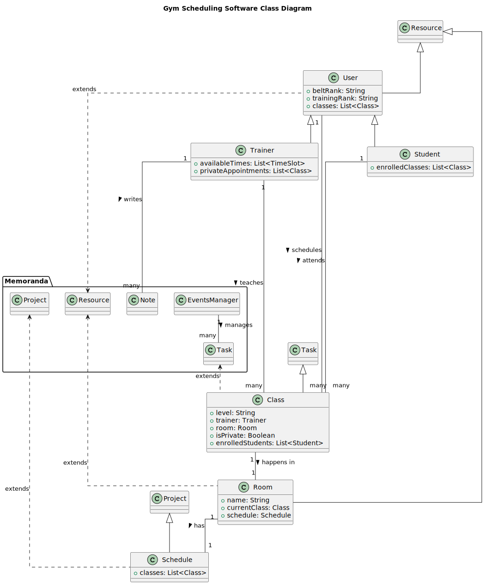

# Key Classes

1.  **Project**: memoranda/Project.java

> Represents a project or major task, with a name, a start and end date, and a list of associated tasks.

2.  **Task**: **memoranda/Task.java**

>  Represents a task, with a name, description, start and end dates, and a status (active, completed, etc.)

3. **EventsManager**: memoranda/date/CalendarDate.java / memoranda/ui/EventsPanel.java

> Manages all events in the system, such as adding, deleting, and updating tasks and projects, The functionality is spread across memoranda. In particular CalendarDate.java & EventsPanel.java

4.  **Note**: memoranda/Note.java

> Represents a note, which is just a simple text document.

5.  **ResourcesList**: memoranda/util/Local.java

> Manages all the resources or notes. handles the loading and saving of project data

# Proposal

1.  **User (extends Project)**: 
>Consider each user (Owner, Trainer, Student) as a "project". Add fields for belt rank, training rank, etc. for Trainers and enrolled classes for Students.

2.  **Class (extends Task)**: 
>Treat each martial arts class as a "task". Add fields for level (beginner or advanced), trainer, room, time, isPrivate, and enrolledStudents.

3.  **Room (new class)**: 
>This could be a new class to manage room schedules. This class might interact with the existing EventsManager class to handle scheduling.

4.  **Schedule (uses EventsManager)**: 
>You could use the existing EventsManager class for the gym's schedule, but you'll need to extend it to handle your specific scheduling requirements.

5.  **Note (extends Note)**: 
>The note-taking functionality should already exist in Memoranda, but you may need to extend the Note class to add user-specific notes.

6.  **ResourcesList**: 
>This could be used to manage trainers, students, and maybe rooms as well. You might need to extend it to handle your specific requirements.

# Class diagram

